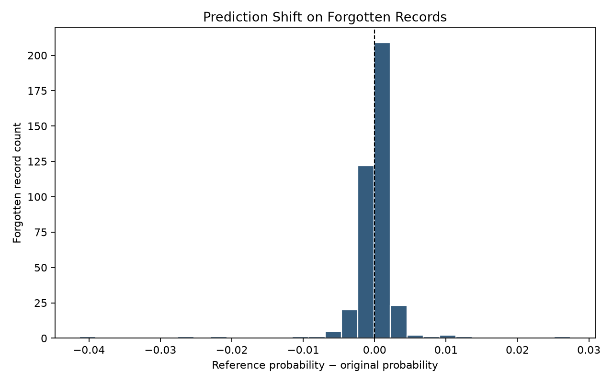

# Auditable Machine Unlearning Service

A reproducible **machine unlearning** implementation for tabular machine learning that compares **exact retraining** against **SISA-style selective shard retraining** on the Adult Income dataset.

The project emphasizes reproducibility, auditability, and empirical evaluation of deletion requests while measuring utility, computational cost, behavioral similarity, and privacy.

---

# Why This Project Exists

Deleting a record from storage does **not** remove its influence from a trained machine learning model.

This repository investigates whether retraining can eliminate the contribution of deleted records while preserving predictive performance and reducing computational cost.

Rather than treating unlearning as a theoretical concept, this project produces reproducible evidence through deterministic experiments and auditable artifacts.

---

# System Architecture

```text
Dataset + Stable Record IDs
            │
            ▼
Deterministic Train/Test Split
            │
    ┌───────┴────────┐
    │                │
    ▼                ▼
Original Model   Exact Retain-Only Reference
                     │
                     ▼
         Five Independent Shards
                     │
                     ▼
        Deletion Manifest Routing
                     │
                     ▼
      Selective Shard Retraining
                     │
                     ▼
 Utility • Behavior • Cost • Privacy Evaluation
```

---

# Features

- Exact retain-only retraining
- Deterministic SHA-256 shard assignment
- Independent preprocessing for every shard
- Independent classifier training per shard
- Mean-probability ensemble aggregation
- Selective retraining of deletion-affected shards
- Architecture-matched retraining reference
- Confidence-based membership inference evaluation
- SHA-256 integrity verification of unaffected model artifacts
- Fully reproducible experiment configuration

> **Note**
>
> This repository implements a **SISA-style** approach. Slice checkpointing from the original SISA algorithm is **not** currently implemented.

---

# Results

## Utility

| Metric | Original | Exact Reference | Sharded Ensemble |
|---------|---------:|---------------:|----------------:|
| Accuracy | 0.852390 | 0.852288 | 0.853004 |
| F1 | 0.656339 | 0.656183 | 0.658258 |
| ROC-AUC | 0.904230 | 0.904225 | 0.904652 |
| Log Loss | 0.321083 | 0.321123 | 0.320237 |

---

## Selective Unlearning

| Measurement | Result |
|-------------|-------:|
| Affected Shards | 1 |
| Selective Retraining Time (s) | 0.077546 |
| Full Sharded Retraining Time (s) | 0.319094 |
| Observed Speedup | **4.114894×** |
| Test Prediction Disagreement | 0.000000 |
| Mean Probability Gap | 0.000000 |
| Unaffected Artifact Hashes | ✓ Verified |

---

## Membership Inference Evaluation

| Measurement | Original | Exact Reference |
|-------------|---------:|---------------:|
| Attack ROC-AUC | 0.470382 | 0.470428 |
| Forget-Set Predicted Member Rate | 0.997442 | 0.997442 |

---

### Probability Shift on Forgotten Records



### Membership Inference Comparison


---

# Quick Start

## Create Environment

```bash
python -m venv .venv

# Windows PowerShell
.venv\Scripts\Activate.ps1

python -m pip install --upgrade pip
python -m pip install -e .
python -m pip install -r requirements-dev.txt
```

---

## Run the Complete Experiment

```bash
python scripts/run_pipeline.py
python scripts/audit_project.py
```

---

## Run Tests

```bash
pytest -m "not integration" -v
pytest -v
ruff check src tests scripts
```

---

## Inspect MLflow

```bash
mlflow ui --backend-store-uri ./mlruns
```

Open:

```
http://127.0.0.1:5000
```

---

# Reproducibility

The experiment is fully deterministic through:

- versioned configuration
- stable record identifiers
- seeded train/test splitting
- deterministic SHA-256 shard assignment
- seeded bootstrap resampling

Runtime measurements are intentionally excluded from equality comparisons because execution time depends on machine hardware and operating-system scheduling.

---

# Methodology

The evaluation compares two architectures.

## Exact Retraining

The deleted records are removed from the training set and the entire model is retrained.

This architecture serves as the **counterfactual reference** representing a model that never observed the deleted data.

## SISA-Style Retraining

Training data are partitioned into deterministic shards.

Only the shard containing deleted records is retrained while unaffected shard models remain unchanged.

Model integrity is verified using SHA-256 hashes.

---

# Limitations

- Slice checkpoints from the original SISA algorithm are not implemented.
- The classifier is a linear baseline designed for tabular data.
- Privacy evaluation uses a single black-box confidence attack.
- Single-record privacy measurements are descriptive rather than statistically definitive.
- Behavioral similarity and attack resistance provide empirical evidence rather than a formal deletion certificate.
- Runtime measurements are machine-dependent.

---

# References

1. Bourtoule et al. *Machine Unlearning.*
2. Shokri et al. *Membership Inference Attacks Against Machine Learning Models.*
3. Yeom et al. *Privacy Risk in Machine Learning.*

---

# Conclusion

Exact retraining establishes the behavior of a model that never trained on the deleted records.

The **SISA-style** implementation reproduces its architecture-matched reference by retraining only the affected shards while leaving unaffected model artifacts byte-identical.

The computational advantage depends primarily on **deletion locality**—that is, how many shards are touched by a deletion request—rather than on deletion count alone.

The membership inference experiment provides an additional empirical privacy signal. However, its conclusions remain bounded by the discrimination ability of the chosen attack and the size of the evaluated forget set. Consequently, the reported results support an **auditable engineering claim** rather than a formal guarantee of information removal.
