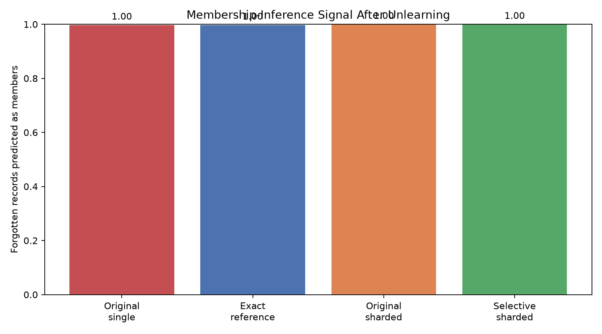

# Can a Model Efficiently Forget a User?

## Experimental setup

We use version 2 of the Adult Income dataset and a deterministic
80/20 stratified split. Every record receives a stable identifier
before splitting. The original model combines median numerical
imputation, feature scaling, categorical imputation, one-hot encoding
and logistic regression in one serialized pipeline.

A seeded uniform sampler selects 1% of the training records as the
forget set. All later unlearning methods receive this exact manifest.

## Baseline results

| Measurement | Result |
|---|---:|
| Test accuracy | 0.8523902139420616 |
| Test F1 | 0.6563393708293613 |
| Test ROC-AUC | 0.9042302959684185 |
| Test log loss | 0.32108308976974026 |
| Training time | 0.3593632999691181 seconds |
| Training records | 39073 |
| Forget records | 391 |

## Initial interpretation

The original model establishes predictive utility before deletion.
These results do not demonstrate forgetting. Subsequent experiments
will compare retrained and selectively unlearned models against this
baseline.

## SISA-style sharded training

We deterministically assigned each record to one of five isolated
shards using a SHA-256-derived mapping. Each shard trained an independent
preprocessing and logistic-regression pipeline. At inference, the system
averages positive-class probabilities across the five models.

The current implementation supports sharding, isolation and aggregation.
Slice checkpointing remains future work, so we describe the system as
SISA-style rather than a complete SISA implementation.

### Initial ensemble results

| Measurement | Single model | Sharded ensemble |
|---|---:|---:|
| Test accuracy | 0.8523902139420616 | 0.8530044016787798 |
| Test F1 | 0.656339370829361 | 0.658257972394098 |
| Test ROC-AUC | 0.9042302959684185 | 0.9046523136897092 |
| Test log loss | 0.32108308976974026 | 0.32023699971906844 |
| Sequential training time | 0.3348593999980949 | 0.24476749998575542 |
| Maximum shard time | N/A | 0.24476749998575542 |

### Shard distribution

| Shard | Records | Training time |
|---:|---:|---:|
| 0 | 7955 | 05087130000174511 |
| 1 | 7885 | 0.0497248000028776 |
| 2 | 7808 | 0.04501209998852573 |
| 3 | 7660 | 0.04772809999121819 |
| 4 | 7765 | 0.05143120000138879 |

### Interpretation

TODO: Explain whether dividing the data reduced predictive utility.

TODO: Explain why initial training cost is not the main SISA benefit.

TODO: State that deletion-time speedup still requires direct
measurement.

## Selective single-record unlearning

The deletion request affected one of five shard models. We retrained
only that shard after removing the requested record and copied all
unaffected artifacts byte-for-byte.

For correctness, we independently retrained all five shards on the
same retained dataset. This full sharded retraining serves as the
architecture-matched reference.

### Selective-unlearning results

| Measurement | Selective | Full sharded reference |
|---|---:|---:|
| Retrained shards | TODO | 5 |
| Retraining time | 0.08650579999084584 | 0.40916789998300374 |
| Test accuracy | TODO | 0.8529020370559934 |
| Test F1 | 0.6579385860509402 | 0.6579385860509402 |
| Test disagreement | 0.0 | — |
| Mean probability gap | 0.0 | — |

Observed speedup: **TODO×**

Unaffected artifact hashes unchanged: **TODO**

### Interpretation

TODO: State whether selective and full-reference predictions matched.

TODO: Explain the measured speedup without assuming it must equal the
theoretical five-times value.

TODO: Explain how byte-identical unaffected artifacts support the
isolation claim.

## Membership-inference evaluation

We evaluated a black-box attacker that knows a record's correct label
and observes model probabilities. The attacker uses true-label
log-confidence and calibrates a model-specific threshold using equal
numbers of known members and nonmembers.

### Distributed forget-set results

| Measurement | Original | Exact reference |
|---|---:|---:|
| Attack balanced accuracy |  0.506 | 0.505 |
| Attack ROC-AUC | 0.47038199999999997 | 0.47042800000000007 |
| Forget-set predicted-member rate | 0.9974424552429667 | 0.9974424552429667 |
| 95% bootstrap interval | 0.9923273657289002 | 0.9923273657289002 |

### Single-record sharded result

| Model | Predicted as member? |
|---|---:|
| Original sharded ensemble | member |
| Selectively unlearned ensemble | member |

### Interpretation

TODO: State whether the exact-reference member rate was lower than the
original rate. - No—the exact-reference member rate was not lower than the original rate; it was the same (0.9974424552429667 in both cases, with the same 95% bootstrap interval)

TODO: State whether the attack itself had meaningful discrimination. - No—the attacker showed no meaningful discrimination. Its balanced accuracy (~0.505–0.506) is essentially chance, and ROC-AUC (~0.470) is also near-random.

TODO: Describe the single-record result as descriptive rather than
statistically conclusive. - The single-record outcome (1 record classified as “member”) is descriptive only; with n = 1 there is no confidence interval / no statistical power, so it is not statistically conclusive evidence about membership or forgetting.

These results measure resistance to one confidence-based attack. They
do not establish a formal privacy guarantee or prove that every trace
of a record has been removed.

## Reproducibility and operational validation

The complete experiment is controlled by a versioned JSON configuration
covering the dataset version, random seed, split fraction, deletion
fraction, shard count and privacy-evaluation parameters.

A cross-platform runner executes the stages in dependency order:

1. Baseline training and deletion-manifest generation
2. Exact retain-only retraining
3. Isolated sharded-ensemble training
4. Selective-retraining planning
5. Selective shard unlearning
6. Membership-inference evaluation

Every stage has an artifact contract. The workflow fails if an expected
model, manifest, result field or figure is absent or empty.

Pull requests run network-independent unit tests on Python 3.11 and 3.12.
The complete dataset and training workflow is manually triggered because it
depends on external data and produces comparatively expensive artifacts.

### Reproducibility scope

Seeded model metrics, record assignments, forget manifests, prediction
comparisons and bootstrap intervals should be reproducible. Runtime
measurements are expected to vary with hardware, operating-system load and
dependency implementation.

### Remaining limitations

- The current design is SISA-style because slice checkpointing is not yet
  implemented.
- The privacy experiment evaluates one confidence-based membership attack.
- Single-record privacy results are descriptive.
- Exact retraining provides a behavioral reference, not a formal deletion
  certificate.

experiment command = python scripts/run_pipeline.py